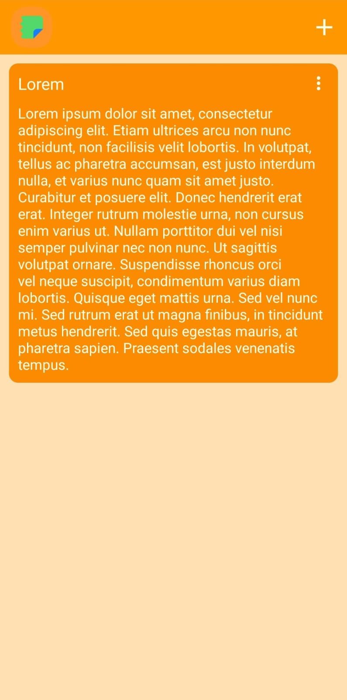
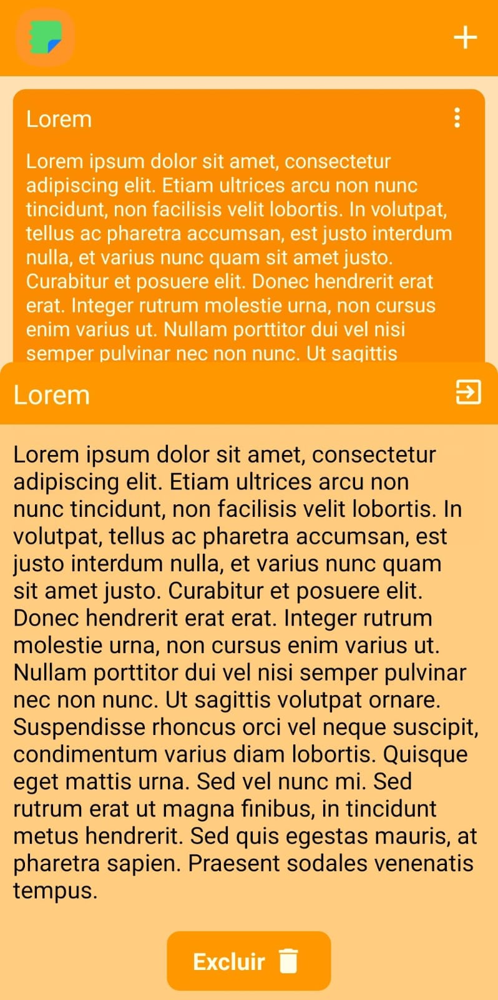
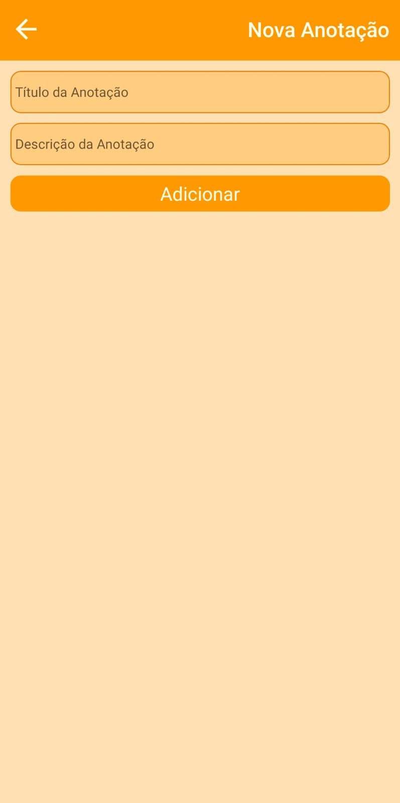

# Note.me

O Note.me é um aplicativo mobile onde você pode fazer anotações importantes sobre o seu cotidiano: lembretes sobre o trabalho, da casa ou suas metas pessoais. Deixe sua mente cuidar do que realmente importa, e o resto o Note.me guarda para você.

O aplicativo foi desenvolvido em React Native com expo. O objetivo do desenvolvimento desta aplicação foi puramente educacional, visando entender os fundamentos do RN. Todos os conceitos implementados nessa aplicação foram aprendidos através do curso de React Native da Rocketseat, ministrado pelo Rodrigo Gongalves.

# Layout da Aplicação

Os wireframes usados como base para a implementação da UI podem ser visualizados neste link: https://lucid.app/lucidchart/8e67ff62-8f80-4f30-8b20-ff51b5752d52/edit?invitationId=inv_baf6f9ec-86fa-4dbf-90e7-1382ad3887cf&page=0_0





# Tecnologias e ferramentas

* React Native

A demanda por mão de obra que trabalhe com esta linguagem de programação tem aumentado significativamente, o que gerou a necessidade de aprendizagem dela - e consquentemente a existência desse projeto.

* Expo

O Expo foi utilizado como a ferramenta de gestão do projeto RN por sua ampla utilização por desenvolvedores que utilizam a linguagem.

* Async Storage

Para a persistência local das anotações, foi utilizado o AsyncStorage, já que pela natureza de aprendizagem da aplicação, ele iria somente persistir informações simples sobre as Anotações.

* Material Design

A definição do esquema de cores foi feita baseado no sistema de cores do Material Design.

* IconScout

O ícone da aplicação foi criado com a ajuda do IconScout, de forma gratuita.

* Gemini

A ferramenta de ia generativa foi utilizada como fonte de consulta para dúvidas, especialmente em relação a definição de ferramentas de UX/UI.

# Como executar

Para executar a aplicação em sua máquina (celular ou emulador), é necessário seguir os seguintes passos:

1. Instalar o Node.JS (https://nodejs.org/pt/download);
2. Instalar o Git (https://git-scm.com/downloads);
3. Caso você queira executar o aplicativo em seu dispositivo físico, é necessário instalar nele o Expo GO (https://play.google.com/store/apps/details?id=host.exp.exponent&hl=pt_BR&gl=US&pli=1 para Android; https://apps.apple.com/br/app/expo-go/id982107779 para iOS);
4. Realizar o clone deste projeto localmente;
5. Dentro de seu projeto local, executar o seguinte comando:
``` bash
npx expo start
```
6. Para executar o aplicativo em seu emulador, basta escolher a opção desejada após a execução da aplicação em sua máquina. Para a execução em seu dispositivo físico, é necessário:

    6.1. Abrir o Expo GO em seu dispositivo;

    6.2. Escolher a opção "Scan QR Code";
    
    6.3. Apontar a câmera do seu dispositivo para o QR Code que foi gerado na tela ao executar a aplicação em sua máquina.


# Colaboradores

A implementação deste projeto foi feita exclusivamente por mim, Lucas Manoel. A estrutura de código utizada foi inspirada no projeto proposto pelo Rodrigo Gonçalves em seu minicurso de React Nativa da Rocketseat.